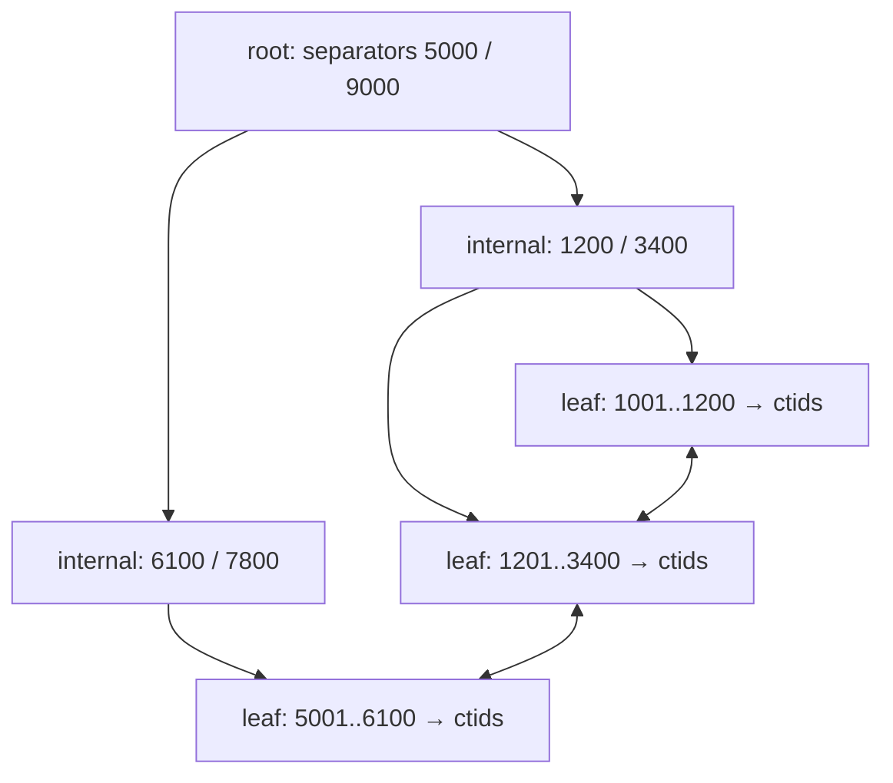

# Database Indexing — Understand (Part 1)

[Part 2 T6-T10 →](1_understand_part2.md)

## Table of Contents

- [T1. Why Indexes Exist](#t1-why-indexes-exist)
- [T2. Heap Files and Row Identifiers](#t2-heap-files-and-row-identifiers)
- [T3. B-Tree Index Structure](#t3-b-tree-index-structure)
- [T4. Clustered and Secondary Indexes](#t4-clustered-and-secondary-indexes)
- [T4.1. Covering Indexes and Index Only Scans](#t4-1-covering-indexes-and-index-only-scans)
- [T5. Composite Index Column Order](#t5-composite-index-column-order)

## T1. Why Indexes Exist

<sub>Levels: [Foundation](0_foundation_part1.md#t1-why-indexes-exist) · Understand · [Interview](2_interview_part1.md#t1-why-indexes-exist) · [Production](3_production_part1.md#t1-why-indexes-exist)</sub>

**Core intuition:** an index converts a filter from work proportional to table size into work
proportional to the number of matching rows plus the depth of a tree.

A sequential scan reads every page of the heap and applies the predicate to each row. Its cost
is linear in table size and completely insensitive to how many rows match — one match in ten
million costs the same as ten million matches. Sequential reads are fast per byte, which is
why the planner still chooses a scan when the filter keeps a large fraction of the table.

An index lookup instead descends a tree to the first qualifying entry, then walks the leaf
level while the predicate still holds. Cost is roughly `log(n)` page reads to locate the start,
plus one read per matching entry, plus — for a secondary index (T4) — one heap fetch per row
to retrieve the columns the index does not hold.

Those heap fetches are the part people forget. They are random reads scattered across the
file, and each one may pull in a page to return a single row. Past some fraction of the table,
doing thousands of random reads costs more than reading everything sequentially, which is
exactly the trade-off selectivity estimation (T6) exists to settle.

Two consequences follow. First, an index helps a query only if the query's predicate matches
the index's leading columns (T5). Second, "add an index" is never free: the read win is paid
for on every write (T7).

> 💡 **Tip:** Reason about an index in terms of the *fraction of the table it eliminates*, not
> the size of the table. That single reframing predicts most planner decisions.

**Predict the output.** Two queries on a ten-million-row `orders` table, both with an index on
`status`:

```sql
SELECT * FROM orders WHERE status = 'refunded';   -- 900 rows match
SELECT * FROM orders WHERE status = 'complete';   -- 9,400,000 rows match
```

Which one uses the index?

<details><summary>Answer</summary>

The first. The second keeps 94% of the table, so an index scan would perform millions of random
heap fetches to return nearly everything — strictly worse than reading the heap sequentially
once. The same index is used or ignored depending on the *value*, because the planner estimates
selectivity per value from the column statistics.

</details>

## T2. Heap Files and Row Identifiers

<sub>Levels: [Foundation](0_foundation_part1.md#t2-heap-files-and-row-identifiers) · Understand · [Interview](2_interview_part1.md#t2-heap-files-and-row-identifiers) · [Production](3_production_part1.md#t2-heap-files-and-row-identifiers)</sub>

**Core intuition:** the heap is an array of fixed-size pages, and every index entry is a
pointer into it — so anything that moves a row makes work for every index.

PostgreSQL stores a table as 8 KB pages. Each page has a header, an array of item pointers,
and row data filling in from the end. A `ctid` of `(42,7)` means page 42, slot 7. Reading a row
by `ctid` is therefore one page read plus an offset lookup — the cheapest possible access.

The complication is MVCC. An `UPDATE` does not overwrite a row; it writes a new version and
marks the old one dead. The new version usually lands on a different page, so it gets a
different `ctid`, and every index on the table must gain an entry pointing at the new location.

That is what a HOT update avoids. When the update touches no indexed column *and* the new
version fits on the same page, PostgreSQL chains the new version to the old one within the page
and skips the index updates entirely. Free space on the page is what makes this possible, which
is why leaving room in pages is a real tuning lever (T7).

Dead versions accumulate until `VACUUM` reclaims them; until then they occupy pages and are
still pointed at by index entries, which is why an unvacuumed table gets slower on reads as
well as bigger on disk.

> ⚠️ **Warning:** Never store a `ctid` in your application. It is a physical address, not an
> identity — an update or a `VACUUM FULL` invalidates it.

**Predict the output.**

```sql
CREATE TABLE t (id int PRIMARY KEY, note text);
INSERT INTO t VALUES (1, 'a');
SELECT ctid FROM t WHERE id = 1;   -- (0,1)
UPDATE t SET note = 'b' WHERE id = 1;
SELECT ctid FROM t WHERE id = 1;   -- ?
```

<details><summary>Answer</summary>

`(0,2)` — a new row version in slot 2 of the same page. The value changed even though the
primary key did not, because the update wrote a new version rather than modifying the old one.
The index on `id` did not need a new entry here: `note` is not indexed and the new version fit
on the same page, so this qualifies as a HOT update.

</details>

## T3. B-Tree Index Structure

<sub>Levels: [Foundation](0_foundation_part1.md#t3-b-tree-index-structure) · Understand · [Interview](2_interview_part1.md#t3-b-tree-index-structure) · [Production](3_production_part1.md#t3-b-tree-index-structure)</sub>

**Core intuition:** high fanout is the whole trick — a few hundred keys per page means a
three-level tree already addresses tens of millions of rows.

A B-tree page is the same 8 KB unit the heap uses. An internal page stores separator keys and
child pointers; a leaf page stores index entries — the key plus the `ctid` — in sorted order.
Leaves are doubly linked, so once a search lands on one, a range scan is a sideways walk with
no further descents.



With roughly 8 KB per page and a small integer key, a page holds on the order of several
hundred entries, so depth grows extremely slowly: level 1 addresses hundreds of rows, level 2
hundreds of thousands, level 3 hundreds of millions. Nearly every lookup you will ever profile
is three or four page reads, and the upper levels are almost always already in the buffer
cache.

Insertion keeps the tree balanced by splitting: a full leaf splits in two and pushes a
separator up, which may split the parent in turn, and in the limit the root splits and the tree
grows a level. Splits are why an index is not simply appended to, and why random-key insertion
costs more than sequential-key insertion (T7).

A B-tree also supports more than equality. Because leaves are ordered, it answers `BETWEEN`,
`<`, `>`, prefix matching with `LIKE 'abc%'`, and `ORDER BY` on the indexed columns without a
sort step — the last of which is often the bigger win.

**Predict the output.** An index exists on `orders(created_at)`. Which of these can use it?

```sql
SELECT * FROM orders ORDER BY created_at DESC LIMIT 10;
SELECT * FROM orders WHERE date_trunc('day', created_at) = DATE '2026-07-01';
```

<details><summary>Answer</summary>

The first, and not the second. The first is answered by walking the leaf level backwards for
ten entries — no sort, no scan. The second applies a function to the column, so the predicate
is not on the indexed value at all; it needs an expression index on `date_trunc('day',
created_at)` (T9), or a rewrite to a range `created_at >= … AND created_at < …`.

</details>

## T4. Clustered and Secondary Indexes

<sub>Levels: [Foundation](0_foundation_part1.md#t4-clustered-and-secondary-indexes) · Understand · [Interview](2_interview_part1.md#t4-clustered-and-secondary-indexes) · [Production](3_production_part1.md#t4-clustered-and-secondary-indexes)</sub>

**Core intuition:** clustering decides whether the row *is* the leaf entry or is somewhere else
entirely — one indirection versus two.

In InnoDB, the primary key index is the table: leaf pages hold complete rows in primary-key
order. A lookup by primary key ends at the leaf. Every other index is secondary and stores the
primary key as its pointer, so a secondary lookup costs a descent through the secondary index
plus a full descent through the clustered index — two tree traversals.

In PostgreSQL there is no clustered index. The heap (T2) is always separate and every index,
including the primary key's, stores `ctid`s. A primary-key lookup is a tree descent plus a
single page read, and every index costs the same shape of access. The `CLUSTER` command is a
one-off physical reordering of the heap, not a maintained clustered index; new writes go
wherever there is space and the ordering decays.

The practical differences follow from that:

- InnoDB range scans on the primary key are sequential in the clustered index, which makes
  primary-key ranges unusually cheap.
- A wide or random InnoDB primary key inflates every secondary index, since each entry carries
  a copy of it. This is the standard argument for a narrow, monotonic primary key.
- PostgreSQL's uniform indirection makes an extra index cost the same regardless of which
  columns it holds, but it means no index gets to skip the heap fetch — except when the scan
  can be answered index-only (T4.1).

**Predict the output.** In InnoDB, `users` has primary key `id` and an index on `email`. How
many B-tree descents does `SELECT name FROM users WHERE email = ?` perform?

<details><summary>Answer</summary>

Two. The first descends the `email` index and finds the primary key value; the second descends
the clustered index to fetch the row containing `name`. The second descent disappears if the
index is changed to cover `name` as well (T4.1).

</details>

## T4.1. Covering Indexes and Index Only Scans

<sub>Levels: [Foundation](0_foundation_part1.md#t4-1-covering-indexes-and-index-only-scans) · Understand · [Interview](2_interview_part1.md#t4-1-covering-indexes-and-index-only-scans) · [Production](3_production_part1.md#t4-1-covering-indexes-and-index-only-scans)</sub>

**Core intuition:** covering removes the second access — you pay for the tree descent and
nothing else.

An index-only scan is available when every column referenced anywhere in the query — the
`SELECT` list, the `WHERE` clause, the `ORDER BY` — is present in the index. PostgreSQL builds
these with `INCLUDE`:

```sql
CREATE INDEX orders_customer_idx
  ON orders (customer_id, created_at)
  INCLUDE (total_cents);
```

`customer_id` and `created_at` are key columns: searchable, sortable, and usable as a prefix
(T5). `total_cents` is a payload column: stored in the leaf, returnable, and not searchable.
Keeping payload out of the key matters — key columns widen every level of the tree, payload
columns only widen the leaves.

There is a PostgreSQL-specific catch. The index does not record whether a row version is
visible to your transaction, so an index-only scan still has to check the *visibility map* — a
per-page bitmap marking pages where every row is visible to everyone. If the page is marked
all-visible the heap fetch is skipped; if it is not, the fetch happens anyway. A table with
heavy write churn and infrequent vacuuming will show `Heap Fetches: <large>` in `EXPLAIN
ANALYZE` and get much less benefit than the plan name suggests.

> 🎯 **Interview Note:** "Index-only scan" does not mean the heap is never touched in
> PostgreSQL. It means the heap is touched only for pages the visibility map cannot vouch for.

**Predict the output.** Given the index above, which of these can be index-only?

```sql
SELECT total_cents FROM orders WHERE customer_id = 7;
SELECT total_cents, status FROM orders WHERE customer_id = 7;
```

<details><summary>Answer</summary>

Only the first. The second reads `status`, which is in neither the key nor the `INCLUDE` list,
so every matching row needs a heap fetch. Coverage is a property of the index-query pair, not
of the index.

</details>

## T5. Composite Index Column Order

<sub>Levels: [Foundation](0_foundation_part1.md#t5-composite-index-column-order) · Understand · [Interview](2_interview_part1.md#t5-composite-index-column-order) · [Production](3_production_part1.md#t5-composite-index-column-order)</sub>

**Core intuition:** a composite index is sorted by a tuple, so it is only useful from the left
edge inwards.

Entries in an index on `(a, b, c)` are ordered by `a`, then `b`, then `c`. A search can use
consecutive leading columns for as long as each one is constrained by equality, and it can use
one range at the end. `WHERE a = 1 AND b = 2 AND c > 5` uses all three. `WHERE a = 1 AND c = 3`
uses only `a` — the qualifying entries are contiguous by `a`, but `c` is scattered inside that
stretch, so `c` becomes a filter applied to the rows the index returns.

The rule of thumb that follows: **equality columns first, then the range or sort column.** An
index on `(status, created_at)` serves `WHERE status = 'pending' ORDER BY created_at` perfectly
— the qualifying entries form a contiguous run already in the right order, so the sort
disappears. Reverse the columns and the same query must sort.

Column order also decides how many indexes you need. `(a, b)` serves searches on `a` and on
`(a, b)`, so a separate index on `a` is redundant. It does *not* serve searches on `b` alone,
which is a genuinely separate index if that query matters.

Direction matters only for multi-column sorts. A B-tree can be walked either way, so
`ORDER BY a DESC` is served by an index on `(a)`. But `ORDER BY a ASC, b DESC` needs the mixed
declaration `(a ASC, b DESC)`, because no single walk direction produces that ordering.

**Predict the output.** With one index on `events(tenant_id, occurred_at)`, which need a sort
step?

```sql
SELECT * FROM events WHERE tenant_id = 3 ORDER BY occurred_at;
SELECT * FROM events WHERE occurred_at > now() - interval '1 day' ORDER BY tenant_id;
```

<details><summary>Answer</summary>

The second. The first is an equality on the leading column followed by an ordered walk — the
index delivers rows in `occurred_at` order for free. The second constrains only the second
column, so the index cannot be used to locate rows at all, and the result still has to be
sorted by `tenant_id`.

</details>

[Part 2 T6-T10 →](1_understand_part2.md)
